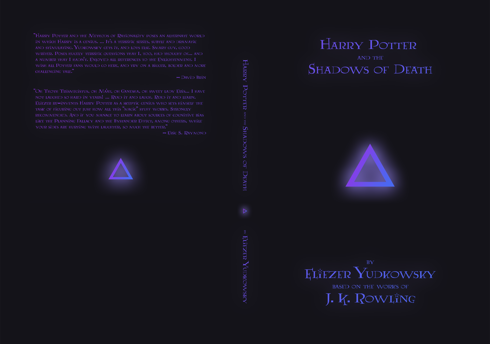
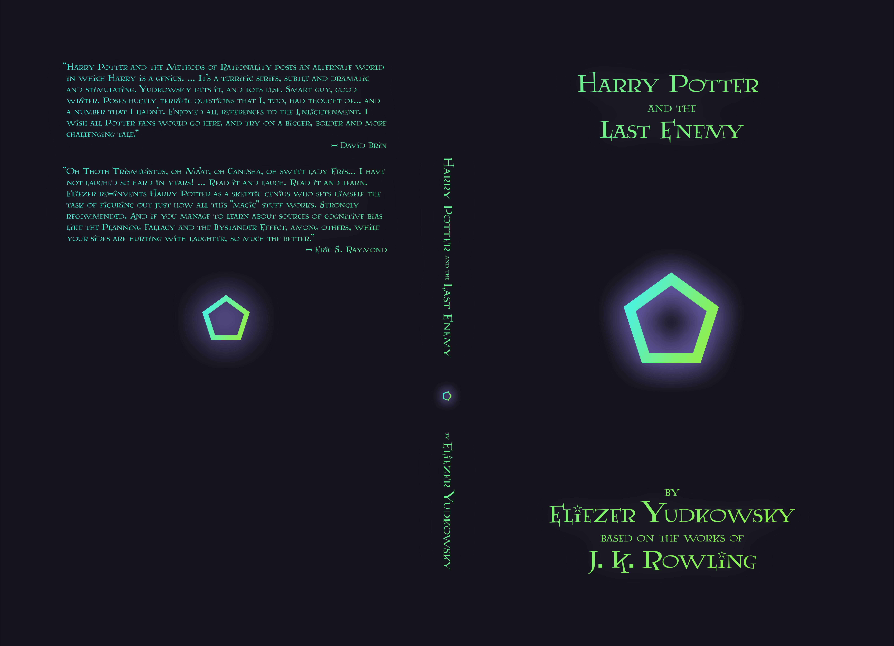
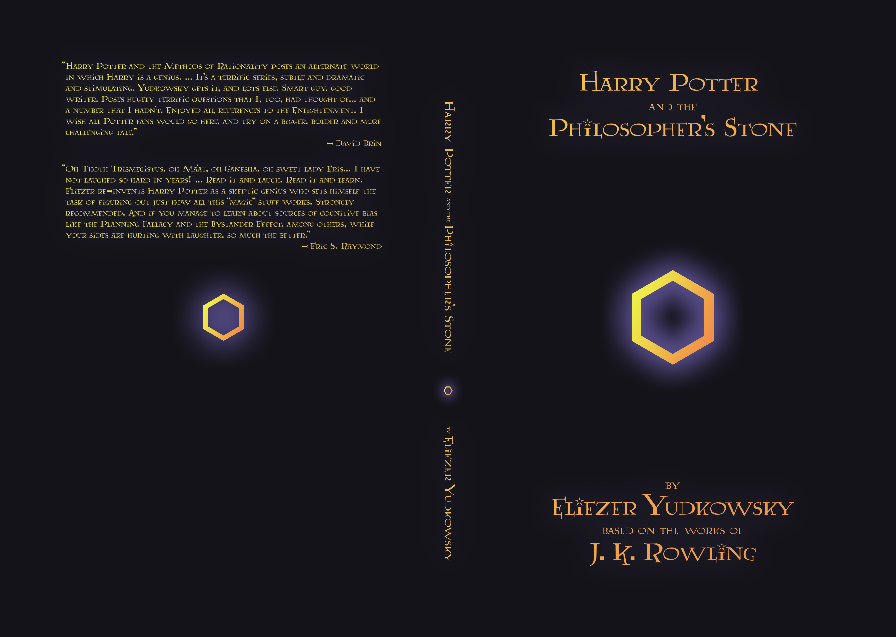

This repository contains a set of covers for _[Harry Potter and the Methods of Rationality](http://hpmor.com/)_. The series comprises six volumes all together. This repository includes a `contents.pdf` and `cover.png` for each volume.

[](1%20-%20Harry%20Potter%20and%20the%20Methods%20of%20Rationality/cover.png)

> Every inch of wall space is covered by a bookcase. Each bookcase has six shelves, going almost to the ceiling. Some bookshelves are stacked to the brim with hardback books: science, maths, history, and everything else. Other shelves have to layers of paperback science fiction, with the back layer of books propps up on old tissue boxes or lengths of...

```yaml
Title: Harry Potter and the Methods of Rationality
Pages: 354
Size: 6" x 9"
```

[](2%20-%20Harry%20Potter%20and%20the%20Professor's%20Games/cover.png)

> A small study room, near but not in the Ravenclaw dorm, one of the many many unused rooms of Hogwarts. Gray stone the floors, red brick the walls, dark stained wood the ceiling, four glowing glass globes set into the four walls of the room. A circular table that looked like a wide slab of black marble set on thick black marble legs for columns, but...

```yaml
Title: Harry Potter and the Professor's Games
Pages: 288 
Size: 6" x 9"
```

[](3%20-%20Harry%20Potter%20and%20the%20Shadows%20of%20Death/cover.png)

> Bright the sun, bright the air, bright the students and bright their parents, clean the paved ground of Platform 9.75, the winter Sun hanging low in the sky at 9:45AM in the morning on January 5th, 1992. Some of the younger students wore scarves and mittens, but most simply wore their robes; they were wizards, after all. After Harry had moved away from...

```yaml
Title: Harry Potter and the Shadows of Death
Pages: 402 
Size: 6" x 9"
```

[](4%20-%20Harry%20Potter%20and%20the%20Phoenix's%20Call/cover.png)

> Hermione Granger had read somewhere once, that one of the keys to staying thing was to pay attention to the food you ate, to notice yourself eating it, so that you were satisfied with the meal. This morning she'd made herself toast, and put butter on the toast, and cinnamon on the butter, and it really should've been enough to get her to _notice_...

```yaml
Title: Harry Potter and the Phoenix's Call
Pages: 396
Size: 6" x 9"
```

[](5%20-%20Harry%20Potter%20and%20the%20Last%20Enemy/cover.png)

> The four of them gathered once more around the ancient desk of the Headmaster of Hogwarts, with its drawers within drawers within drawers, wherein all the past paperwork of the Hogwarts School was stored; legend had it that Headmistress Shehla had once gotten lost in that desk, and was, in fact, still there, and wouldn't be let out again until...

```yaml
Title: Harry Potter and the Last Enemy
Pages: 234
Size: 6" x 9"
```

[](6%20-%20Harry%20Potter%20and%20the%20Philosopher's%20Stone/cover.png)

> May 13th, 1992. Argus Filch's face appeared twisted in the light of the oil lamp he held, shadows dancing over his face. Behind them the doors of Hogwarts quickly receded, and the dark grounds moved closer. The track they now walked was muddy and indistinct. The trees, branches formerly bare with winter, were not fully clad with spring; their...

```yaml
Title: Harry Potter and the Philosopher's Stone
Pages: 324
Size: 6" x 9"
```
